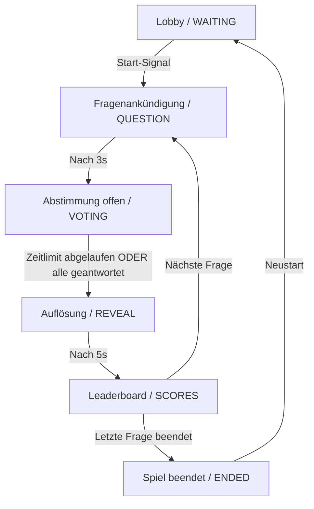

# AALeC Quiz — Backend / Game Master

Der Game Master ist die zentrale Steuerungseinheit (der Spielleiter) des AALeC Quiz. Er wird in Python implementiert, läuft im Hintergrund und kommuniziert in Echtzeit über MQTT mit den Controllern und dem Frontend.

---

## 🛠️ Stack & Abhängigkeiten

- **Sprache**: Python (Version >= 3.10)
- **Paketmanager**: `uv` (schneller Cargo-basierter Python-Paketmanager)
- **Hauptbibliotheken**:
  - `paho-mqtt` (MQTT-Client für Kommunikation mit dem Broker)
  - `Flask` (REST-API für die Verwaltung von Fragensets im Admin-Panel)

---

## 📂 Dateistruktur

- `game_master.py` — Der gesamte Spielleiter-Code (MQTT-Subskriptionen, State Machine, REST-API, Punkteberechnung).
- `questions.json` — Die Standard-Fragenliste (wird beim ersten Start geladen).
- `game_state.json` — Persistierter Spielstand. Ermöglicht die Wiederaufnahme eines laufenden Spiels nach einem Serverneustart.
- `Dockerfile` — Definiert den Container für das Backend in Produktion/Entwicklung.

---

## 🔄 Spiel-Zustandsautomat (State Machine)

Der Game Master steuert den Ablauf des Quiz über einen zentralen Zustandsautomaten:



1. **`WAITING`**: Lobby-Modus. Geräte können sich verbinden, Namen auswählen und registrieren. Der Admin kann Fragensets wechseln.
2. **`QUESTION`**: 3-Sekunden-Ankündigungsphase. Der Fragentext wird übertragen und auf Beamer sowie Controllern angezeigt.
3. **`VOTING`**: Antwortphase. Eingaben der Spieler (Buzzer/Poti) werden entgegengenommen. Läuft, bis das Zeitlimit abläuft oder alle angemeldeten Spieler geantwortet haben.
4. **`REVEAL`**: Auflösung. Die richtige Antwort sowie Statistiken werden an alle Teilnehmer gesendet. Punkte werden basierend auf Richtigkeit, Antwortzeit und Antwort-Streak berechnet.
5. **`SCORES`**: Scoreboard. Die aktuelle Rangliste wird auf dem Beamer angezeigt. Nach 5 Sekunden geht es zur nächsten Frage (oder zum Ende).
6. **`ENDED`**: Spiel vorbei. Die endgültige Platzierung wird gezeigt, Konfetti wird auf dem Beamer gerendert.

---

## 🔌 REST-API (Admin Interface)

Der Game Master stellt eine REST-API auf Port `8080` bereit, über die das Admin-Panel Fragensets verwalten und aktivieren kann.

| Methode | Endpoint | Beschreibung |
| :--- | :--- | :--- |
| `GET` | `/api/question-sets` | Gibt eine Liste aller verfügbaren `.json` Fragensets im Verzeichnis zurück. |
| `GET` | `/api/question-sets/<name>` | Lädt ein bestimmtes Fragenset. |
| `PUT` | `/api/question-sets/<name>` | Erstellt oder überschreibt ein Fragenset. Validiert das Format vor dem Speichern. |
| `DELETE` | `/api/question-sets/<name>` | Löscht ein Fragenset (außer dem aktuell aktiven). |
| `GET` | `/api/active-set` | Gibt den Namen des aktuell aktiven Fragensets zurück. |
| `POST` | `/api/active-set` | Wechselt das aktive Fragenset (nur im Zustand `WAITING` erlaubt). |

---

## 📡 MQTT-Topic-Struktur

Der Game Master interagiert mit folgenden Topics:

### Vom Game Master gesendet (Publish)
- `quiz/state` (Retained): Aktueller Zustand (`{"state": "WAITING", "question_id": 12, "remaining_s": 20}`).
- `quiz/question`: Die Details der aktuellen Frage (Text, Typ, Antwortoptionen, Limits).
- `quiz/reveal`: Die Auflösung (`{"correct": "A", "counts": {"A": 3, "B": 1, ...}}`).
- `quiz/scores`: Das gesamte Scoreboard (`{"scores": [{"device_id": "...", "name": "...", "score": 1200}, ...]}`).
- `quiz/players` (Retained): Liste aller aktuell verbundenen Geräte.
- `quiz/ack/<device_id>`: Anmeldebestätigung für einen Controller.
- `quiz/answer_count`: Live-Zwischenstand der abgegebenen Stimmen (`{"count": 2, "total": 4}`).
- `quiz/namelist` (Retained): Weiterleitung der Namensliste für die manuelle Namenswahl auf den Controllern.
- `quiz/name/reset`: Signalisiert den Controllern, die Namenswahl zurückzusetzen.

### Vom Game Master empfangen (Subscribe)
- `quiz/connect/<device_id>`: Verbindungssignal eines ESP8266-Controllers samt gewähltem Spielernamen.
- `quiz/disconnect/<device_id>`: LWT-Signal (Last Will and Testament), falls ein ESP8266 die Verbindung verliert.
- `quiz/answer/<device_id>`: Antwortabgabe eines Spielers (`{"question_id": 1, "answer": "A", "elapsed_ms": 1540}`).
- `quiz/control`: Admin-Befehle vom Frontend (`{"action": "start" / "restart" / "reset_names" / "load_set"}`).
- `quiz/namelist/set`: Namensliste, die im Beamer-Lobby-Frontend konfiguriert wurde.

---

## 🏆 Punkteberechnung

Die Punktevergabe wird dynamisch berechnet:
1. **Multiple Choice (MCQ) & Höher/Niedriger**:
   - Richtige Antwort: **1000 Basispunkte**.
   - Zeitbonus: Bis zu **500 Punkte** zusätzlich (linearer Abfall basierend auf Antwortgeschwindigkeit).
   - Streak-Bonus: **200 Punkte** pro Stufe der aktuellen Streak (max. 3 Stufen, d.h. +600 Punkte).
2. **Schätzfragen**:
   - Gestaffelte Punktevergabe basierend auf der Abweichung zum Zielwert relativ zur Skalenspannne (`|Schätzung - Richtig| / Bereich`):
     - Exakt (0% Abweichung): **1000 Punkte**.
     - <= 5% Abweichung: **800 Punkte**.
     - <= 10% Abweichung: **600 Punkte**.
     - <= 20% Abweichung: **400 Punkte**.
     - <= 30% Abweichung: **200 Punkte**.
     - Sonst: 0 Punkte.
   - Zeitbonus kommt bei korrekter/ausreichend naher Schätzung ebenfalls dazu.
3. **Poti- & Temperatur-Challenge**:
   - Die Punkte nehmen linear von **1000 Basispunkten** (bei exakter Übereinstimmung) bis **0 Punkten** (am Rand des Toleranzbereichs) ab.

---

## 🚀 Lokale Ausführung (Entwicklung)

1. **Abhängigkeiten installieren**:
   ```bash
   uv sync
   ```
2. **Game Master starten**:
   ```bash
   uv run game_master.py --broker localhost --port 1883 --questions questions.json
   ```
